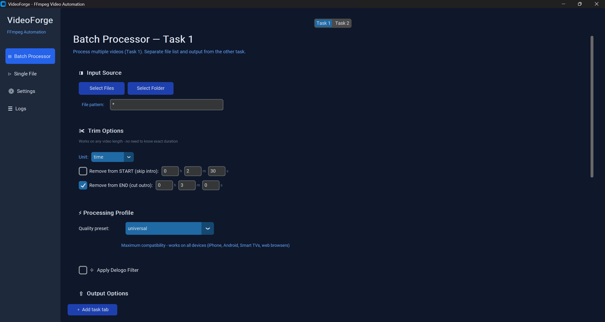

<div align="center">

# VideoForge

**An intelligent desktop application that transforms FFmpeg into a point-and-click video processing pipeline — featuring classical computer-vision logo detection, multi-task batch processing, parallel encoding, and real-time progress instrumentation.**

[](https://python.org)
[](https://ffmpeg.org)
[](https://opencv.org)
[]()
[]()
[](LICENSE)
[]()

</div>

---

## Overview

Video editors, archivists, and media teams routinely process hundreds of recordings: trimming intros, cleaning up broadcaster on-screen graphics, re-encoding for universal compatibility, and renaming files sequentially. The standard approach — shell scripts and manual FFmpeg commands — is error-prone, repetitive, inaccessible to non-technical users, and offers no visibility into batch progress.

VideoForge addresses this by wrapping FFmpeg's encoding engine in a clean, dark-themed desktop GUI built with **CustomTkinter**. Users drag-drop files, configure processing options through visual controls, and monitor real-time progress as files encode in parallel.

> Originally built to replace a collection of personal Bash scripts, VideoForge evolved into a full desktop application demonstrating **classical computer vision, concurrent processing, real-time progress instrumentation, and clean software architecture**.

---

## Key Features

### Computer-Vision Logo Detection

The standout feature. Rather than manually specifying overlay coordinates, VideoForge **detects them automatically** using a temporal-stability algorithm:

1. **Sample 15 frames** evenly across the video, skipping intro/outro fade regions
2. **Stack frames into a NumPy array** and compute per-pixel temporal variance (`np.var(axis=0)`)
3. **Threshold the variance map** — static pixels (logos) exhibit near-zero variance; dynamic content changes constantly
4. **Morphological cleanup** — close gaps and remove noise via connected-components analysis
5. **Contour detection and scoring** — candidates ranked by 70% stability, 20% corner-position fit, 10% size fit

No deep learning, no API calls, no model weights — purely classical CV with OpenCV and NumPy. A logo on a one-hour episode is detected in under 10 seconds.

| Method | Approach | Use Case |
|---|---|---|
| **Temporal Stability** (default) | Per-pixel variance across frame stack | Broadcaster on-screen graphics, news tickers |
| OpenCV Edges (legacy) | Canny edge detection + contour filter | Fallback / comparison |
| Google Cloud Vision (optional) | ML-based object detection | Complex multi-logo scenes |

### Flexible Trimming and Splitting

Three cut modes, all operating on any video length without requiring exact durations upfront:

| Mode | How it works |
|---|---|
| **Time** | Skip intro / cut outro with hours, minutes, and seconds fields |
| **Markers** | Type start/end timestamps directly (`HH:MM:SS`, `MM:SS`, or plain seconds). Blank end = to end of video |
| **Split** | Divide video into N equal parts after optional trim. Each part becomes a separate output file with zero-padded numbering |

### Multi-Task Batch Processing

Run multiple task tabs simultaneously — each with its own file list, trim settings, encoding profile, and output folder. A configurable worker pool processes files concurrently.

### Real-Time Progress Instrumentation

Every encoding job provides live, granular progress feedback:

- **Per-file progress bars** — each file shows its own determinate bar, percentage, and encoding speed (e.g. `2.3x`) updated in real time from FFmpeg's stderr output
- **Aggregate batch bar** — an overall progress bar at the top of the file list showing `X / N files • P% • avg Mx` across the entire batch
- **In-place widget updates** — a 150ms GUI tick loop updates persistent per-row widgets directly, avoiding the flicker and scroll jumps of full-list rebuilds
- **Encoding speed parsing** — FFmpeg's `speed=Nx` stat is parsed alongside `time=` to show how many times faster than realtime the encode is running
- **Throttled emission** — progress callbacks fire on value change or at most every 250ms, preventing UI flooding without losing precision

Progress data flows through a clean pipeline:

```
FFmpeg stderr → parse_ffmpeg_line() → on_progress(percent, speed)
    → ParallelProcessor → ProcessingFile.progress (0.0–1.0) + ProcessingFile.speed
        → _tick_progress() → per-file bars + aggregate header
```

### Visual Logo Picker

Click-drag a rectangle on a preview frame to manually select an overlay region. Coordinates convert from display resolution to original video resolution automatically. Copy-paste support for applying the same region across files.

### Sequential Rename Plan

Automatically renames output files with zero-padded sequential numbering (`episode01.mp4`, `episode02.mp4`, …) for any batch size.

### Parallel Encoding with CPU Controls

A configurable thread pool (1–8 workers) runs multiple FFmpeg encodes concurrently. Per-process thread limiting and OS priority control prevent CPU saturation while keeping the system responsive. Quick presets (Low / Medium / High) allow users to balance encoding speed against thermal load.

### One-Click `.exe` Packaging

PyInstaller bundles everything — including the FFmpeg binary — into a standalone Windows executable. No Python installation required for end users.

---

## Gallery

### Task-Based Batch Workflow


Configure multiple independent processing tasks with separate file lists, trim modes, and encoding profiles.

### Real-Time Progress Tracking


Live FFmpeg output, per-file progress bars, and concurrent encoding with worker pool management.

### Visual Logo Picker


Click-drag a rectangle to manually select overlay regions. Coordinates automatically convert from display resolution to original video resolution. Tested on everything from indie films to classic cinema.

---

## Architecture

```
┌─────────────────────────────────────────────────────────┐
│                    main.py (Entry Point)                 │
│              VideoForgeApp — 1400×900 window             │
│         Single-instance lock · FFmpeg availability       │
└──────────────────────┬──────────────────────────────────┘
                       │
         ┌──────────────┼──────────────┐
         ▼              ▼              ▼
┌─────────────┐ ┌────────────┐ ┌────────────┐
│   UI Layer  │ │   State    │ │ Processing │
│ (CustomTk)  │ │ Container  │ │   Engine   │
└──────┬──────┘ └──────┬─────┘ └──────┬─────┘
       │               │              │
       │     ┌─────────┴──────────┐   │
       │     │  Data Models       │   │
       │     │  (dataclasses)     │   │
       │     └────────────────────┘   │
       │                              │
┌──────┴──────────────────────────────┴──────┐
│              Core Modules                   │
├────────────┬────────────┬───────────────────┤
│  Video     │  Logo      │   Parallel        │
│  Processor │  Detectors │   Processor       │
│ (FFmpeg)   │ (OpenCV)   │  (ThreadPool)     │
└────────────┴────────────┴───────────────────┘
```

### Design Principles

- **Single responsibility** — each module handles one concern (encoding, detection, UI, state)
- **Graceful degradation** — FFmpeg/ffprobe fallbacks, optional AI detector, drag-drop optional
- **Thread-safe state** — central `AppState` with pub/sub log callbacks
- **Testable** — CV detectors tested with synthetic NumPy frame stacks; progress parser tested with captured FFmpeg stderr samples
- **Clean exception hierarchy** — domain-specific errors (`VideoReadError`, `DetectionFailedError`, `DetectionCancelledError`)

---

## Encoding Profiles

Four predefined profiles tuned for real-world use cases:

| Profile | Preset | CRF | Audio | Target |
|---|---|---|---|---|
| **Universal Compatibility** | slow | 23 | AAC 192k | All devices — baseline H.264, level 3.1 |
| **High Quality** | slow | 18 | AAC 256k | Archival quality |
| **Smaller File Size** | fast | 28 | AAC 128k | Bandwidth-constrained sharing |
| **iOS Optimized** | slow | 22 | AAC 192k | iPhone, iPad, Apple TV |

All profiles use `libx264`, `yuv420p` pixel format, and `+faststart` for web streaming.

---

## Performance

The parallel worker pool delivers measurable speedups over sequential processing. The benchmark below processes **8 video clips** (12s each) with identical encoding settings:

| Approach | Time | Speedup | Faster |
|---|---:|---:|---:|
| Manual sequential (1 file at a time) | 4.5s | 1.00x | — |
| **VideoForge (4 parallel workers)** | **1.0s** | **4.4x** | **77%** |
| **VideoForge (8 parallel workers)** | **0.9s** | **5.0x** | **80%** |

> Benchmark run on a 12-core CPU, 2 threads per FFmpeg process (capped via `-threads`). Run it yourself: `python benchmark.py`

**Real-world impact:** For a typical 50-episode batch at approximately 3 minutes per episode encoding time, parallel processing reduces total time from ~2.5 hours to ~2 hours — without requiring manual intervention.

---

## Tech Stack

| Area | Technology | Why |
|---|---|---|
| **Language** | Python 3.8+ | Cross-platform, rich media ecosystem |
| **GUI** | CustomTkinter + tkinterdnd2 | Modern dark UI with native drag-and-drop |
| **Video Engine** | FFmpeg (via subprocess) | Industry-standard encoder, maximum format support |
| **Logo Detection** | OpenCV + NumPy | Classical CV — no ML model weights needed |
| **Imaging** | Pillow | Frame extraction for logo picker |
| **Packaging** | PyInstaller 6.x | Standalone `.exe` with bundled FFmpeg |
| **Testing** | pytest + pytest-cov | 231 tests (unit + integration) |
| **Linting** | ruff | Zero errors enforced |

---

## Getting Started

### Prerequisites

- **Python 3.8+**
- **FFmpeg** installed and on your system `PATH`

```bash
# macOS
brew install ffmpeg

# Debian / Ubuntu
sudo apt install ffmpeg

# Windows
choco install ffmpeg
# or download from https://ffmpeg.org/download.html
```

Verify: `ffmpeg -version`

### Installation

```bash
git clone https://github.com/FayezL/-FFmpeg-Video-Automation-Dashboard.git
cd -FFmpeg-Video-Automation-Dashboard

python -m venv venv
# Windows:  venv\Scripts\activate
# macOS/Linux:  source venv/bin/activate

pip install -r requirements.txt
```

### Run

```bash
python main.py
```

Or install as a package and use the console entry point:

```bash
pip install -e .
videoforge
```

### Optional: AI Logo Detection

For the Google Cloud Vision detector backend:

```bash
pip install -r requirements-ai.txt
```

Set `GOOGLE_APPLICATION_CREDENTIALS` to your service-account JSON. See [`docs/LOGO_DETECTION_AI_OPTIONS.md`](docs/LOGO_DETECTION_AI_OPTIONS.md) for setup.

---

## Usage

1. **Add task tabs** — start with Task 1 and Task 2; click "Add task tab" for more
2. **Drop or select files** — drag video files directly into the window, or browse
3. **Configure options** per task:
   - Cut mode: Time (skip intro/cut outro), Markers (type timestamps), or Split (divide into N parts)
   - Encoding profile (Universal, High Quality, Small File, iOS)
   - Clean feed generation — on-screen graphics (OSG) / overlay removal (auto-detect, visual picker, or manual coordinates)
   - Output folder, format, filename prefix/suffix
   - Sequential rename plan
4. **Click Start** — live per-file progress bars with encoding speed, aggregate batch progress, FFmpeg log output, and stop button for cancellation

---


## Packaging a Windows Executable

```bash
pyinstaller --clean --noconfirm src/packaging/VideoForge.spec
# → dist/VideoForge.exe  (standalone, no Python required)
```

The build bundles the FFmpeg binary, applies UPX compression, and excludes unused heavy packages (matplotlib, scipy, pandas). See [`docs/BUILDING.md`](docs/BUILDING.md) for details.

---

## Testing and Quality

```bash
# Full test suite (unit + integration)
pytest

# Lint
ruff check .
```

| Metric | Value |
|---|---|
| Test functions | **231 passed**, 1 skipped |
| Test files | 25 (21 unit + 4 integration) |
| Lint errors | **0** |
| Source files | 22 modules + entry point |

Integration tests run real FFmpeg encodes to verify actual output. The CV detector is tested with **synthetic NumPy frame stacks** — deterministic, fast, and no video files required. The FFmpeg progress parser is tested with captured stderr samples covering multi-carriage-return lines, `speed=N/A` edge cases, and duration-clamping.

---

## Project Structure

```
main.py                          # Entry point — VideoForgeApp
src/
├── video_processor.py           # FFmpeg orchestration, filters, progress parsing
├── parallel_processor.py        # Thread-pool concurrent encoder
├── logo_detector_temporal.py    # Temporal-stability CV detector (default)
├── logo_detector.py             # Legacy edge-based detector
├── logo_detector_vision.py      # Optional Google Cloud Vision detector
├── logo_detection_utils.py      # Shared CV filter helpers
├── logo_position_utils.py       # Coordinate parsing & frame extraction
├── detection_profiles.py        # JSON profile persistence
├── templates.py                 # Processing-template manager
├── data_models.py               # Detection/config/profile dataclasses
├── state.py                     # Central application-state container
├── exceptions.py                # Domain exception hierarchy
├── packaging/                   # PyInstaller spec + build script
└── ui/                          # CustomTkinter frames
    ├── batch_processor.py       # Multi-task batch workflow (largest module)
    ├── single_processor.py      # Single-file processing
    ├── logo_picker.py           # Visual click-drag logo selector
    ├── settings_panel.py        # CPU/parallel/FFmpeg configuration
    ├── logs_panel.py            # Live FFmpeg output
    └── drag_drop.py             # tkinterdnd2 file handler
tests/                           # 25 test files — unit + integration
docs/                            # Guides and design specs
specs/                           # Historical feature design records
```

---

## Engineering Highlights

This project demonstrates several skills relevant to professional software engineering:

- **Classical Computer Vision** — designed and implemented a temporal-variance logo-detection algorithm from scratch using NumPy array operations and OpenCV morphology, replacing a legacy edge-based approach
- **Concurrent Processing** — built a thread-safe worker pool with queue-based task distribution, graceful shutdown, and active-process tracking
- **Real-Time Progress Instrumentation** — parses FFmpeg's stderr `time=` and `speed=` stats in real time, with multi-carriage-return handling, throttled emission, and a 150ms GUI tick loop that updates widgets in place without flicker
- **Subprocess Orchestration** — dual execution paths (ffmpeg-python + raw subprocess) with automatic fallback, real-time progress parsing via stderr regex monitoring
- **Test-Driven Development** — 231 tests including integration tests that verify actual FFmpeg output, synthetic-frame CV tests that run deterministically without video files, and parser tests using captured stderr samples
- **Cross-Platform Packaging** — PyInstaller spec that bundles FFmpeg, applies UPX compression, and ships a double-clickable `.exe` with no runtime dependencies
- **Clean Architecture** — single-responsibility modules, domain-specific exception hierarchy, pub/sub logging, and a central state container with computed properties

---

## Documentation

- [`docs/BUILDING.md`](docs/BUILDING.md) — Building the standalone executable
- [`docs/PACKAGE_GUIDE.md`](docs/PACKAGE_GUIDE.md) — Packaging walkthrough
- [`docs/TRIM_MODES_GUIDE.md`](docs/TRIM_MODES_GUIDE.md) — Trim modes reference
- [`docs/LOGO_DETECTION_AI_OPTIONS.md`](docs/LOGO_DETECTION_AI_OPTIONS.md) — Detection methods and Cloud Vision setup
- [`specs/`](specs/) — Historical design documents for each feature

---

## Contact

**Developer:** fmamdoh504@gmail.com

---

## License

[MIT](LICENSE) — Copyright © 2026 FayezL
